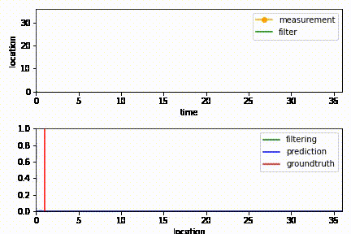
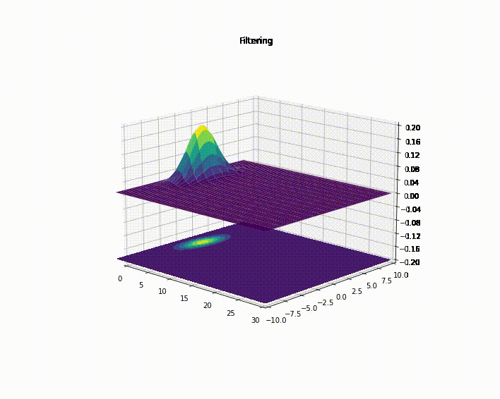
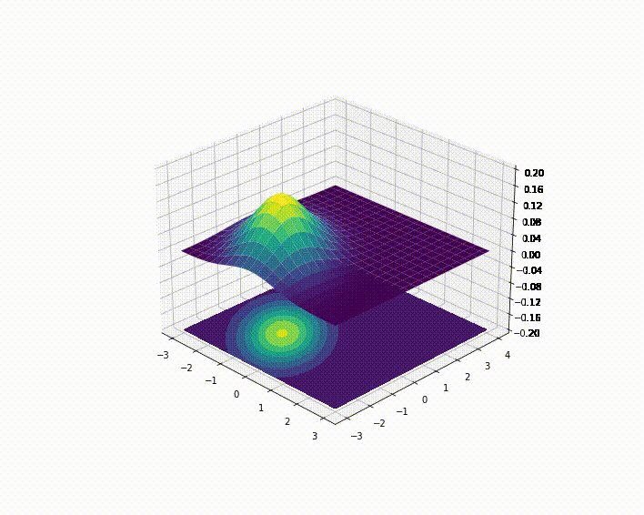
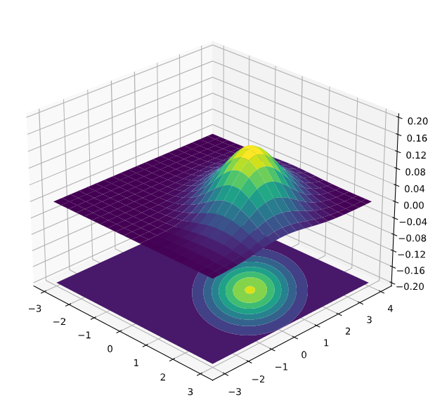
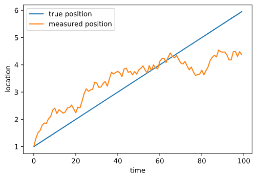
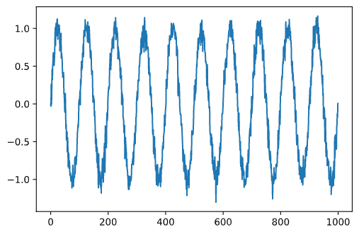
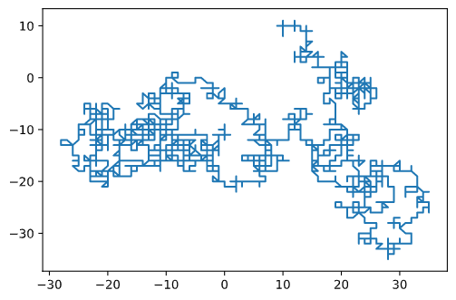

# Sensor Data Fusion - Full Stack

This project implements the three plus one main pillars of Sensor Data Fusion making heavy use of Bayesian inference and properties auf Gaussian distributions.

That is:

- initiation
- prediction
- filtering
- retrodiction

as described in [Wolfgang Koch's book Tracking and Sensor Data Fusion](https://www.springer.com/gp/book/9783642392702).

* * *

First 1D results:

<p align="center">

</p>

The 1D Kalman Filter result above is generated by a simple prediction (adding Gaussians) and correction (multiplying Gaussians) loop without any help from Linear Algebra, yet. See how the filter adjusts its trust towards the measurement model upon the heavy measurement offset around frame 15-20. The evolution model is assuming the start location at `0` and the velocity to be `1` with error `0.05`. Watch also, how the filter corrects the variance quite fast. The initial evolution variance is `10^5`. The sensor error is assumed to be `1.5` and constant. Usually sensors don't have a constant or linear error in their measuring range.

* * *

If time allows, these models will also cover

- Interacting Multiple Models (incorporate maneuver classes into the dynamics model)
- Multiple Hypothesis Tracking (allow multiple 'realities' to converge in a survival-of-the-fittest manner)

To realize this, we need a set of features:

1. Generation of sensor data from one or many sensors with some added noise.
2. Visualization of the true and the SDF-stack generated approximations.
3. An UI to learn through play

## Mathematical basis

### 1D Kalman Filter

The [Kalman Filter](https://en.wikipedia.org/wiki/Kalman_filter) is a two-step [predictor-corrector method](https://en.wikipedia.org/wiki/Predictor%E2%80%93corrector_method).Due to its numerical simplicity it functions very well in situation where realtime decisions have to be made. It has been successfully used in multi-sensor fusion, what we want to implement later on.

According to history it became famous and famously implemented into the Apollo missions after _Rudolf Kálmán_ visited _Stanley Schmidt_ at _NASA_. Schmidt was the first engineer to implement it and is also credited with the divide into two distinct parts: prediction and update.

> Consider: There was no such thing as RAM chips, much less CPUs. The Apollo computer used 2k of magnetic core RAM and 36k wire rope (ROM) memory. The CPU was built from ICs, but not the kind we think of today. They were, in fact, the same Fairchild RTL chips I fell in love with. Clock speed was under 100 kHz.<sup id="a1">[[1]](#f1)</sup>

The Kalman Filter is a two-step [predictor-corrector method](https://en.wikipedia.org/wiki/Predictor%E2%80%93corrector_method).

#### Predict

- (1) predicted state estimate
- (2) uncertainty of the predicted state estimate

or in equations:

```math
x_t = x_{t-1} + v_t \cdot \delta t\\
\sigma_t = \sigma_{t-1} + \delta t^2 \cdot \sigma_t^v + q_t
```

#### Correct

- Using the Kalman gain
- Update/correct state estimate
- Update/correct uncertainty of the state estimate

or in equations:

```math
k_t = \frac{\sigma_t}{\sigma_t + \sigma_r}\\
\bar{x}_t = x_{t} + k_t (z_t - x_t)\\
\bar{\sigma}_t = (1 - k_t) \sigma_t
```

With the vars being in the order of appearance: predicted state estimate, old state, velocity, timestepsize, variance of pred state estimate, previous variance, variance of velocity estimate and process noise variance.

In 1D the Kalman gain is the uncertainty in state divided by the sum of state estimate uncertainty and measurement uncertainty. Imagining what would happen with small measurement uncertainty? What would happen with big state estimate uncertainty?

__In one sentence:__ The Kalman filter estimates the state of a system using a weighted average of the system's predicted state and the (noisy) observed state (= measurement). This weighted average is represented by the Kalman gain.

## A rough development plan:

_Reduced the problem to 1D for now._

- [x] Generate sources and add adjustable noise
    - Created `Target` base class
        - Comes with 1D location and velocity
        - Measurement noise is artificially added in `noisy_step`
- [x] Visualize them to get a feeling for what we are doing
    - Using jupyter in `playground` for now
    - Project runs with `poetry run sdf`
    - Add Gaussian above current position and animate (see gif above)
    - Implement measurement equation as Gauss likelihood (= this is basically the multiply)
- [ ] Model evolution model as Gauss-Markov transition density (scaffold is done)
- [ ] Implement one sensor which can potentially move (for Dopplereffect, which enables (G)MTI)
- [x] Visualize static situation (replicate Fig 2.1) in 2D
- [ ] Add multiple sensors and pull the signals together using eff. measurement error covariance
- [ ] Move sensors to allow TDoA and FDoA (FDoA needs two! => geometric fusion gain? p.42ff)
- [ ] Add explicit noise to generate false positives with 1-3 models
- [ ] Implement a Kalman Filter (if time allows an Extended Kalman Filter, because nature is not linear)
- [ ] Implement 'drop-outs' to motivate retrodiction (not sure how to do this, likelihood can't be zero?!)
- [ ] Implement Retrodiction to compensate drop-outs
- [ ] Implement expectation gates to deal with false positives
- [ ] Add MHT tracking to see how the chain individual gating -> local combining -> pruning works
- [ ] Optional: IMM
- [ ] Optional: Sequential Likelihood Test
- [ ] Optional: Add map-data/tracks as artificial measurements

## Log

To keep myself motivated and it's always nice to look at pictures. :blush:

### Signal sources:

### Generalize Kalman Filter to matrix formalism

This basically implements p.60-p.62 of the book. The state covariance contains the correlated variance of location and velocity now. Else it is equal to the 1D except a way smoother measurement set to not strain the eye.



PS: Numpy is bitch sometimes.

### Moving 2D Gaussian



### 2D Gaussian



### 1D Kalman filter with Gaussians

<p align="center">

</p>

### Noisy 1D with constant velocity



#### Noisy dancer in 2D:



orig: `x(t) = sin(t)`

#### Very noisy static position in 2D:



orig: `[10, 10]`

## Sources

### *Computational science and engineering* by Gilbert Strang

https://math.mit.edu/~gs/cse/

Especially helpful in explaining the Linear Algebra aspects of the Kalman Filter. Especially p. 207 ff.
This also opens the door to parallelization.

### Tracking and Sensor Data Fusion by Wolfgang Koch

https://www.springer.com/gp/book/9783642392702

* * *

Footnotes:

<b id="f1">1:</b> http://www.trs-80.org/interview-jack-crenshaw/ [↩](#a1)